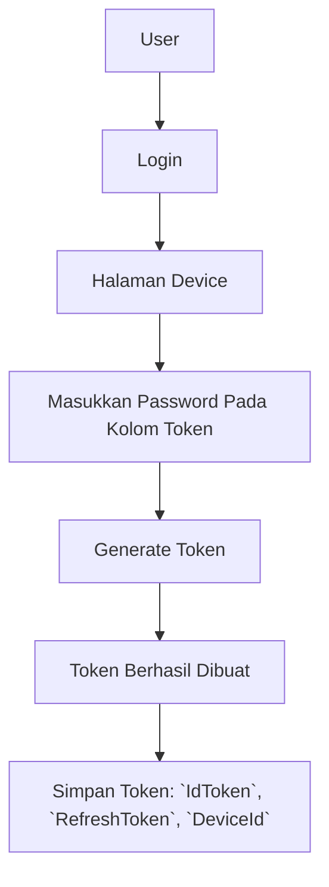
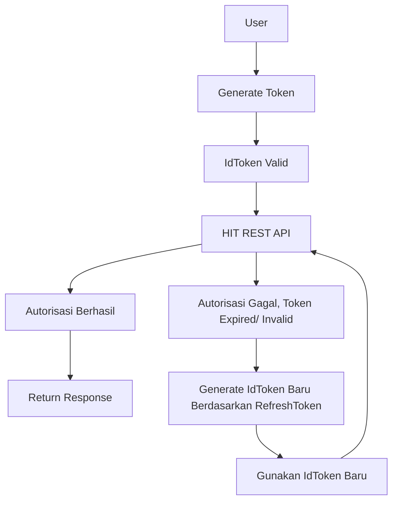

Di sistem baru kami, ada 3 data token yang akan digunakan, yaitu:

1. Id Token = Sebagai akses token ke REST API, Token Aktif 24 Jam
2. Refresh Token = Sebagai generator token, Refresh Token Aktif Permanent
3. Device ID = Uniq ID untuk identifikasi Token, Aktif Permanent bersamaan dengan Refresh Token

## Flow

### Generate Token



### Token Validation



## Refresh Token

### Request

* URL

```
GET https://api.krmpesan.app/token
```

* Query String

| Field           | Type     | Description                                  |
| --------------- | -------- | -------------------------------------------- |
| `refresh_token` | `string` | Refresh Token yang didapat dari sistem login |
| `device_id`     | `string` | Device ID yang didapat dari sistem login     |

### Example Request

```
curl -s "https://api.krmpesan.app/tokens?refresh_token=eyJjdHkiOiJKxxxxxxxx&device_key=ap-southeast-1_3445xxxxx" 
```

### Response

| Fields      | Type     | Description                     |
| ----------- | -------- | ------------------------------- |
| `IdToken`   | `string` | Token untuk akses ke REST API   |
| `ExpiresIn` | `int`    | Waktu kadaluarsa token (24 Jam) |

```json
{
  "AccessToken": "eyJraWQiOiIwajZFcHxxxxxxxxx",
  "ExpiresIn": 86400,
  "TokenType": "Bearer",
  "IdToken": "eyJraWQiOiJnZEJyMUh0alNlTVZjcFxxxxxxx"
}
```

Setelah mendapatkan token, simpan IdToken untuk digunakan pada saat akses ke REST API selanjutnya selama 24 jam.
