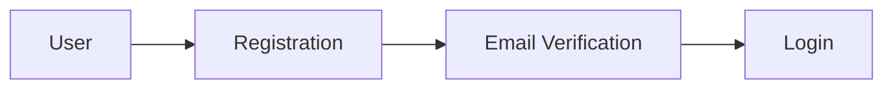
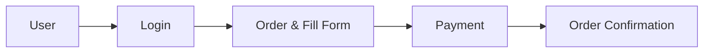
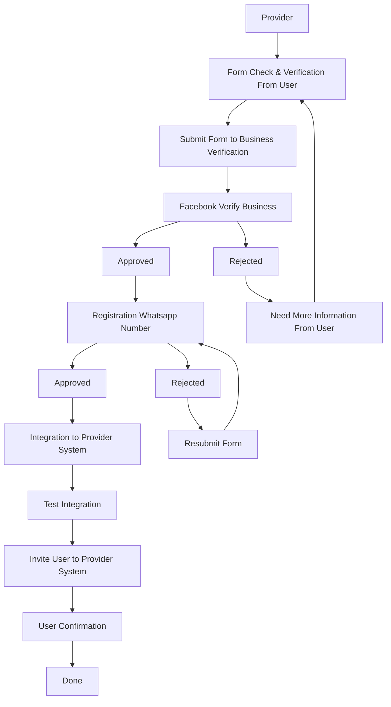

# Registration Process

Pada dokumentasi ini, kami akan membahas proses registrasi yang akan dilakukan oleh user dan kami sebagai penyedia layanan.

## User Registration

### Registration in Billing System

### Order in Billing System

Setelah kami menerima pembayaran, kami akan mengirimkan email konfirmasi ke user dan kami akan memproses orderan user tersebut.

## Provider Registration

Setelah whatsapp number terverifikasi dan integrasi ke sistem provider, user akan diundang untuk bergabung ke sistem provider dan user akan melakukan konfirmasi untuk bergabung ke sistem provider.

Setelah user bergabung, user bisa melakukan penggunaan layanan provider atau integrasi ke sistem provider melalui REST API yang disediakan oleh provider.