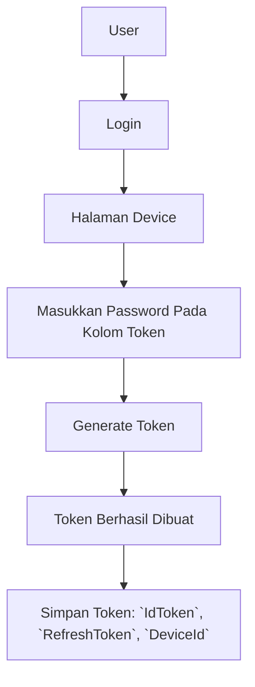

# PHP

## Flow

Di sistem baru kami, ada 3 data token yang akan digunakan, yaitu:

1. Id Token = Sebagai akses token ke REST API, Token Aktif 24 Jam
2. Refresh Token = Sebagai generator token, Refresh Token Aktif Permanent
3. Device ID = Uniq ID untuk identifikasi Token, Aktif Permanent bersamaan dengan Refresh Token

### Generate Token




## Instalasi

### Install via Composer

```
composer require krmpesan/sdk
```

### Install Manual

1. Download file dari repository ini [DI SINI](https://github.com/KrmPesan/SDK-PHP/releases)
2. Copy File `src/Clientv3.php`
3. Done.

## Setting Konfigurasi

**PENTING: Data yang tercantum dibawah hanya sebagai sample, bukan data kami atau data yang sesunggunya.**

```php
<?php
require("ClientV3.php");

use KrmPesan\ClientV3;

$wa = new ClientV3([
    'deviceId' => 'your-device-id',
    'refreshToken' => 'your-refresh-token',
    'idToken' => 'your-id-token',
]);
```

## Kirim Pesan Template Text

### Request

```php
$body = [
    "hello",
    "world"
];

$wa->sendMessageTemplateText('628123456789', 'sample-message', 'id', $body);
```

### Response

```php
stdClass Object
(
    [code] => 200
    [message] => success
    [data] => stdClass Object
        (
            [id] => wamid.xxx
        )

)
```

## Kirim Pesan Template Body + Header Image

### Request

```php
$body = [
    "hello",
    "world"
];
$image = "https://example.com/image.jgp";
$wa->sendMessageTemplateImage('628123456789', 'sample-message-image', 'id', $body, $image);
```

### Response

```php
stdClass Object
(
    [code] => 200
    [message] => success
    [data] => stdClass Object
        (
            [id] => wamid.xxx
        )

)
```

## Kirim Pesan Template Body + Header PDF

### Request

```php
$body = [
    "hello",
    "world"
];
$document = "https://example.com/document.pdf";

$wa->sendMessageTemplateDocument('628123456789', 'sample-message-document', 'id', $body, $document);
```

### Response

```php

stdClass Object
(
    [code] => 200
    [message] => success
    [data] => stdClass Object
        (
            [id] => wamid.xxx
        )

)
```

## Kirim Pesan Template Body + Button

### Request

```php
$body = [
    "hello",
    "world"
];
$button = "https://example.com/";

$wa->sendMessageTemplateButton('628123456789', 'sample-message-button', 'id', $body, $button);
```

### Response

```php

stdClass Object
(
    [code] => 200
    [message] => success
    [data] => stdClass Object
        (
            [id] => wamid.xxx
        )
)
```

## Reply Pesan Text

### Request

```php
$wa->sendReplyText('628123456789', "ini adalah balasannya");
```

### Response

```php
stdClass Object
(
    [code] => 200
    [message] => success
    [data] => stdClass Object
        (
            [id] => wamid.xxx
        )

)
```

## Reply Pesan Body + Header Image

### Request

```php
$wa->sendReplyImage('628123456789', 'https://example.com/image.jpg', 'optional, kalau tidak ada kasih null.');
```

### Response

```php
stdClass Object
(
    [code] => 200
    [message] => success
    [data] => stdClass Object
        (
            [id] => wamid.xxx
        )

)
```

## Reply Pesan Body + Header PDF

### Request

```php
$wa->sendReplyDocument('628123456789', 'https://example.com/document.pdf');
```

### Response

```php
stdClass Object
(
    [code] => 200
    [message] => success
    [data] => stdClass Object
        (
            [id] => wamid.xxx
        )
)
```
