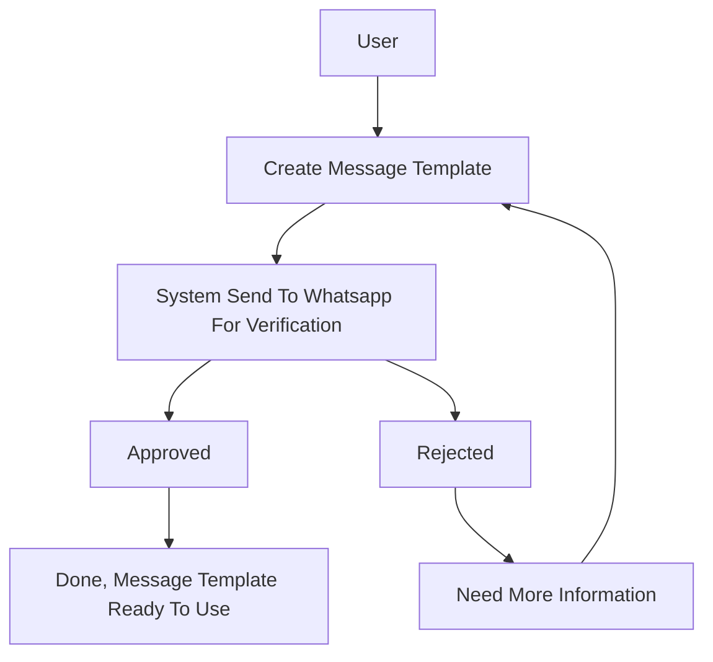

# Message Template

Sebelum anda mulai menggunakan aplikasi kami, anda harus membuat template pesan yang akan anda gunakan untuk mengirimkan pesan.

Message template dapat berupa text, gambar, atau dokumen dengan format yang didukung oleh aplikasi kami.

## Flow Message Template

## Cara membuat message template

1. Pilih menu **Message Template** pada sidebar kiri
2. Klik tombol **Buat** pada bagian atas pojok kanan
3. Anda harus memilih kategori template pesan yang akan anda buat
4. Masukkan nama template pesan, tunggu beberapa saat untuk memastikan nama template pesan yang anda masukkan belum ada
5. Pilih bahasa yang akan anda gunakan untuk template pesan, saat ini kami hanya mendukung bahasa Indonesia dan Inggris
6. Klik tombol **Selanjutnya**
7. Pada halaman ini anda bisa membuat template pesan dengan header, body dimanis, footer, dan button, klik tombol **Sample** untuk melihat contoh template pesan, dan klik tombol **Simpan** untuk menyimpan template pesan yang anda buat.

## Persetujuan template pesan

Setelah anda membuat template pesan, anda harus menunggu persetujuan dari staff whatsapp untuk menggunakan template pesan tersebut.

Biasanyaan approval template pesan akan selesai dalam waktu 1x24 jam. Anda bisa mengecek status persetujuan template pesan pada menu **Message Template** kemudian klik tombol **Tampilkan** pada template pesan yang anda buat.

## Catatan

- Template pesan yang anda buat akan tersimpan di server kami, dan anda bisa menggunakannya kapan saja
- Template pesan yang dihapus, nama template pesan yang dihapus, tidak akan bisa digunakan kembali dalam waktu 4 minggu (30 hari), setelah batas waktu tersebut, template pesan yang dihapus akan dihapus secara permanen dan nama template pesan yang dihapus akan bisa digunakan kembali
- Kami hanya melakukan forward template pesan, persetujuan template pesan bukan dari pihak kami, melainkan dari pihak whatsapp
- Kami tidak bertanggung jawab atas template pesan yang anda buat, jika anda mengirimkan template pesan yang mengandung konten yang melanggar aturan whatsapp, anda akan dikenakan sanksi oleh pihak whatsapp sesuai dengan ketentuan yang berlaku