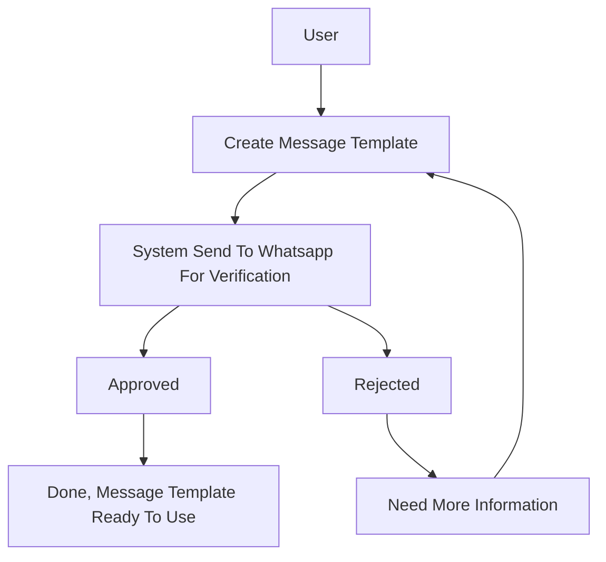

import Tabs from "@theme/Tabs";
import TabItem from "@theme/TabItem";

# Message Template

Sebelum anda mulai menggunakan aplikasi kami, anda harus membuat template pesan yang akan anda gunakan untuk mengirimkan pesan.

Message template dapat berupa text, gambar, atau dokumen dengan format yang didukung oleh aplikasi kami.

## Flow Message Template

## Harga

Biaya berdasarkan dari kategori template, jika anda mengirim pesan dengan kategori berbeda, anda akan dikenakan biaya berbeda pula.

## Cara membuat message template

1. Pilih menu **Message Template** pada sidebar kiri
2. Klik tombol **Buat** pada bagian atas pojok kanan
3. Anda harus memilih kategori template pesan yang akan anda buat
4. Masukkan nama template pesan, tunggu beberapa saat untuk memastikan nama template pesan yang anda masukkan belum ada
5. Pilih bahasa yang akan anda gunakan untuk template pesan, saat ini kami hanya mendukung bahasa Indonesia dan Inggris
6. Klik tombol **Selanjutnya**
7. Pada halaman ini anda bisa membuat template pesan dengan header, body dimanis, footer, dan button, klik tombol **Sample** untuk melihat contoh template pesan, dan klik tombol **Simpan** untuk menyimpan template pesan yang anda buat.

## Persetujuan template pesan

Setelah anda membuat template pesan, anda harus menunggu persetujuan dari staff whatsapp untuk menggunakan template pesan tersebut.

Biasanyaan approval template pesan akan selesai dalam waktu 1x24 jam. Anda bisa mengecek status persetujuan template pesan pada menu **Message Template** kemudian klik tombol **Tampilkan** pada template pesan yang anda buat.

:::danger PENTING

- Template pesan yang anda buat akan tersimpan di server kami, dan anda bisa menggunakannya kapan saja
- Template pesan yang dihapus, nama template pesan yang dihapus, tidak akan bisa digunakan kembali dalam waktu 4 minggu (30 hari), setelah batas waktu tersebut, template pesan yang dihapus akan dihapus secara permanen dan nama template pesan yang dihapus akan bisa digunakan kembali
- Kami hanya melakukan forward template pesan, persetujuan template pesan bukan dari pihak kami, melainkan dari pihak whatsapp
- Kami tidak bertanggung jawab atas template pesan yang anda buat, jika anda mengirimkan template pesan yang mengandung konten yang melanggar aturan whatsapp, anda akan dikenakan sanksi oleh pihak whatsapp sesuai dengan ketentuan yang berlaku

:::

## Contoh

### Utillity / Transactional Template

#### Confirm or suspend an existing transaction

<Tabs groupId="translate">
  <TabItem value="id" label="Indonesia">
    <ul>
      <li>Pesanan Anda #0021 dikonfirmasi</li>
      <li>
        Anda telah berhasil check-in! Ini boarding pass untuk penerbangan Anda
      </li>
      <li>Terima kasih atas reservasi Anda! Sampai jumpa minggu depan</li>
      <li>
        Pembayaran Anda telah diterima! Kami harap Anda menikmati konsernya!
      </li>
      <li>
        Pesanan Anda telah dibatalkan; pengembalian dana Anda akan diproses
        dalam 7-10 hari
      </li>
    </ul>
  </TabItem>
  <TabItem value="en" label="English">
    <ul>
      <li>Your order #0021 is confirmed</li>
      <li>
        You have successfully checked in! Here’s your boarding pass for your
        flight
      </li>
      <li>Thank you for your reservation! See you next week</li>
      <li>Your payment was received! We hope you enjoy the concert!</li>
      <li>
        Your order has been canceled; your refund will be processed in 7-10 days
      </li>
    </ul>
  </TabItem>
</Tabs>

#### Provide an update or reminder post-transaction

<Tabs groupId="translate">
  <TabItem value="id" label="Indonesia">
    <ul>
      <li>
        Pesanan Anda telah dikirim! Pengiriman akan dilakukan pada hari Jumat
      </li>
      <li>Pengingat: Janji temu Anda pukul 1 siang pada hari Selasa</li>
      <li>Berikut laporan bulanan yang Anda minta</li>
      <li>Kata sandi Anda telah diubah</li>
      <li>Pembayaran Anda telah diterima</li>
      <li>Pembayaran Anda gagal</li>
      <li>
        Berikut adalah peringatan saldo rendah Anda untuk akun yang diakhiri
        dengan -XXXX
      </li>
      <li>Saldo prabayar Anda rendah; klik di sini untuk mengisi ulang</li>
    </ul>
  </TabItem>
  <TabItem value="en" label="English">
    <ul>
      <li>Your order has shipped! It will be delivered on Friday</li>
      <li>Reminder: Your appointment is at 1pm on Tuesday</li>
      <li>Here is the monthly statement you requested</li>
      <li>Your password was changed</li>
      <li>Your payment was accepted</li>
      <li>Your payment failed</li>
      <li>Here is your low-balance warning for account ending in -XXXX</li>
      <li>Your pre-paid balance is low click here to top up</li>
    </ul>
  </TabItem>
</Tabs>

### Authentication / OTP Template

Templat autentikasi memungkinkan bisnis mengautentikasi pengguna dengan kode sandi satu kali (biasanya kode alfanumerik 4-8 digit), berpotensi pada beberapa langkah dalam proses masuk (mis., verifikasi akun, pemulihan akun, tantangan integritas).

### Marketing Template

#### Promotions or offers

<Tabs groupId="translate">
  <TabItem value="id" label="Indonesia">
    <ul>
      <li>
        Jika Anda membeli 2 kopi atau lebih, Anda akan mendapat diskon $5!
      </li>
      <li>
        Terima kasih atas pesanan Anda! Gunakan kode SAVE20 untuk diskon 20%
        untuk pesanan berikutnya
      </li>
      <li>
        Saldo prabayar Anda rendah; klik di sini untuk top up! Dapatkan bonus
        10% dengan kode EXTRA10
      </li>
    </ul>
  </TabItem>
  <TabItem value="en" label="English">
    <ul>
      <li>If you buy 2 or more coffees, you’ll get $5 off!</li>
      <li>
        Thanks for your order! Use code SAVE20 for 20% off your next order
      </li>
      <li>
        Your pre-paid balance is low; click here to top up! Get a 10% bonus with
        code EXTRA10
      </li>
    </ul>
  </TabItem>
</Tabs>

#### Welcoming or closing messages

<Tabs groupId="translate">
  <TabItem value="id" label="Indonesia">
    <ul>
      <li>Ini Vinny's Bakery dan kami sekarang ada di WhatsApp!</li>
      <li>Halo, selamat datang di profil kami di WhatsApp!</li>
      <li>Terima kasih, semoga harimu menyenangkan</li>
    </ul>
  </TabItem>
  <TabItem value="en" label="English">
    <ul>
      <li>This is Vinny’s Bakery and we are now on WhatsApp!</li>
      <li>Hello, welcome to our profile on WhatsApp!</li>
      <li>Thank you, have a good day</li>
    </ul>
  </TabItem>
</Tabs>

#### Updates, invitations or recommendations

<Tabs groupId="translate">
  <TabItem value="id" label="Indonesia">
    <ul>
      <li>Toko kami telah pindah. Datang dan periksa kami!</li>
      <li>Kami akan tutup Senin depan untuk liburan</li>
      <li>Kabar baik! Produk yang Anda simpan sudah tersedia kembali.</li>
      <li>
        Bergabunglah dengan kami untuk gala liburan kami yang akan datang!
      </li>
      <li>Ini kupon bulan ini – selamat berbelanja!</li>
      <li>Kami rasa Anda akan menyukai ini – lihat rasa es krim baru kami</li>
    </ul>
  </TabItem>
  <TabItem value="en" label="English">
    <ul>
      <li>Our store has moved. Come and check us out!</li>
      <li>We will be closed next Monday for the holiday</li>
      <li>Good news! The product you saved is back in stock.</li>
      <li>Join us for our upcoming holiday gala!</li>
      <li>Here are this month’s coupons – happy shopping!</li>
      <li>We think you will love this – check out our new ice cream flavor</li>
    </ul>
  </TabItem>
</Tabs>

#### Requests to respond or complete a new transaction

<Tabs groupId="translate">
  <TabItem value="id" label="Indonesia">
    <ul>
      <li>
        Terima kasih atas pesanan Anda. Kami akan senang umpan balik Anda.
        Silakan klik di sini.
      </li>
      <li>Lupa sesuatu? Kami menyimpan barang Anda, klik untuk memeriksa</li>
      <li>
        Lamaran Anda sedang menunggu Anda. Klik di sini untuk menyelesaikan
      </li>
      <li>
        Anda melewatkan janji temu terakhir, ketuk di sini untuk memesan ulang.
      </li>
    </ul>
  </TabItem>
  <TabItem value="en" label="English">
    <ul>
      <li>
        Thank you for your order. We’d love your feedback. Please click here.
      </li>
      <li>Forgot something? We kept your items, click to check out</li>
      <li>Your application is waiting for you. Click here to complete</li>
      <li>You missed your recent appointment, tap here to rebook.</li>
    </ul>
  </TabItem>
</Tabs>
