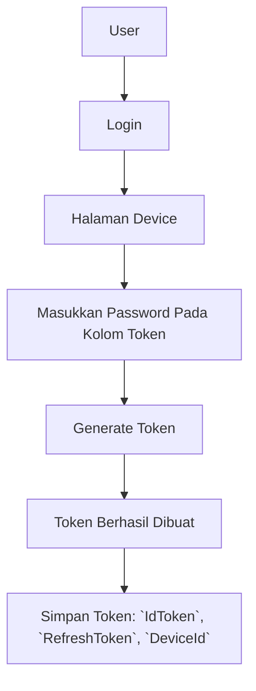

# Migration

Jika anda sudah menggunakan sistem lama kami, anda bisa melakukan migrasi ke sistem baru kami dengan mengikuti langkah-langkah berikut:

1. Ubah URL API dari `https://region01.krmpesan.app/api/v2` atau m`https://region01.krmpesan.app/api/v2` menjadi `https://api.krmpesan.app`
2. Generate ulang token di website [https://krmpesan.app](https://krmpesan.app)
3. Simpan `IdToken`, `RefreshToken` dan `DeviceId`.
4. `IdToken` digunakan untuk akses ke REST API selama 24 jam, jika sudah lebih dari 24 jam, gunakan `RefreshToken` dan `DeviceId` untuk generate `IdToken` yang baru.

## Flow

### Template

- Pada sistem baru kami, anda hanya bisa mengirim pesan ke nomor baru menggunakan template pesan, pastikan template pesan anda sudah di approve terlebih dahulu sebelum digunakan.
- Approval template pesan dilakukan oleh tim whatsapp, bukan kami. Sistem kami hanya mengirimkan permintaan approval ke tim whatsapp.
- Jika permintaan approval template pesan ditolak, anda bisa mengirimkan permintaan approval ulang dengan nama berbeda.
- Pastikan setiap pesan menggunakan kategori yang sesuai, jika tidak sesuai, pesan anda akan ditolak oleh tim whatsapp atau dikenakan biaya berbeda nantinya.
- Saat ini kami mendukung 2 bahasa yaitu Indonesia dan Inggris, jika anda ingin menggunakan bahasa lain, anda bisa menghubungi kami untuk pengecekan.

### Biaya

- Biaya pengiriman pesan dihitung berdasarkan sesi. Anda akan ditagih setiap awal mula sesi saja.
- Sesi aktif selama 24 jam untuk 1 nomor, jika nomor berbeda, maka sesi baru akan dimulai dan anda akan ditagih sesuai dengan sesi baru tersebut.
- Biaya per-sesi adalah Rp. 600,- untuk 1 nomor. (Atau cek diwebsite kami untuk harga terbaru)

### Contoh 1

- Anda mengirim pesan pada nomor 0812xxxx0001 pada pukul 10:00
- Anda kemudian mengirimkan pesan ke-2 pada nomor 0812xxxx0001 pada pukul 10:30
- Anda kemudian mengirimkan pesan ke-3 pada nomor 0812xxxx0001 pada pukul 11:00

Yang anda bayar hanya 1 sesi saja, yaitu sesi ke-1. Sesi ke-2 dan ke-3 tidak akan dikenakan biaya.

### Contoh 2

- Anda mengirim pesan pada nomor 0812xxxx0001 pada pukul 10:00
- Anda kemudian mengirimkan pesan ke-2 pada nomor 0812xxxx0022 pada pukul 11:00
- Anda kemudian mengirimkan pesan ke-3 pada nomor 0812xxxx0033 pada pukul 12:00

Yang anda bayar adalah 3 sesi, yaitu sesi ke-1, ke-2 dan ke-3, karena nomor yang berbeda.