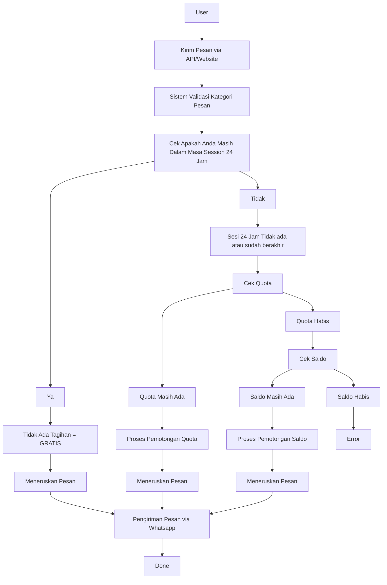

# Quota

Sebelum anda mulai menggunakan aplikasi kami, anda harus memiliki quota untuk mengirimkan pesan.

Setiap akun yang terdaftar di aplikasi kami akan mendapatkan quota gratis sebesar 1000 pesan per-bulan untuk pesan masuk atau keluar.

:::caution

Mulai 1 Juni 2023, Quota gratis akan berubah menjadi 1000 pesan per-bulan untuk pesan yang masuk ke nomor whatsapp.

:::

## Bagaimana Sistem Menghitung Quota

Quota atau Saldo atau Balance adalah saldo yang anda miliki dan akan terpotong setiap anda mengirimkan pesan ke nomor whatsapp setelah session 24 jam.

Kami hanya menghitung pesan yang berhasil dikirimkan ke nomor whatsapp, pesan yang gagal dikirimkan tidak akan terpotong dari saldo anda.

:::info

Setiap pesan memiliki harga berbeda sesuai kategori nya mulai 1 Juni 2023, sebelum 1 Juni 2023, setiap pesan akan kami tagihkan Rp. 600,-

:::

## Apa itu Session 24 Jam

Session 24 jam adalah masa waktu yang kami gunakan untuk menghitung quota anda, setiap anda mengirimkan pesan ke nomor whatsapp, maka anda akan kami tagihkan sesuai dengan kategori pesan yang anda kirimkan.

Jika anda masih dalam masa session 24 jam, maka pesan yang anda kirimkan tidak akan kami tagihkan, dan jika anda sudah melewati masa session 24 jam, maka pesan yang anda kirimkan akan kami tagihkan sesuai dengan kategori pesan yang anda kirimkan.

## Contoh Flow

## Contoh Pengiriman Pesan ke 1 Nomor Whatsapp

Anda mengirimkan pesan ke 1 nomor whatsapp, dan pesan tersebut berhasil dikirimkan, maka saldo anda akan terpotong sebesar **Rp. 600**, dan saldo anda akan terpotong setiap anda mengirimkan pesan ke nomor whatsapp setelah 24 jam.

Berikut adalah contoh pengiriman pesan ke 1 nomor whatsapp:

| No | Waktu | Pesan | Status | Tujuan |
| --- | --- | --- | --- | --- |
| 1 | 07:00 | Pesan 1 | Sukses | 1 Nomor |
| 2 | 12:01 | Pesan 2 | Sukses | 1 Nomor |
| 3 | 14:02 | Pesan 3 | Sukses | 1 Nomor |
| 4 | 16:03 | Pesan 4 | Sukses | 1 Nomor |
| 5 | 21:04 | Pesan 5 | Sukses | 1 Nomor |
| 6 | 23:05 | Pesan 6 | Gagal | 1 Nomor |
| 7 | 23:06 | Pesan 7 | Sukses | 1 Nomor |

Anda akan kami tagihkan Rp. 600 yaitu pada **Pesan 1**, dan **Pesan 2** sampai **Pesan 7** tidak akan terpotong dari saldo anda, karena anda masih dalam masa session 24 jam.

## Contoh Pengiriman Pesan ke 100 Nomor Whatsapp

Anda mengirimkan pesan ke 100 nomor whatsapp, dan pesan tersebut berhasil dikirimkan, maka saldo anda akan terpotong sebesar **Rp. 600 x 100 = Rp. 60.000**, dan saldo anda akan terpotong setiap anda mengirimkan pesan ke nomor whatsapp setelah 24 jam.

Berikut adalah contoh pengiriman pesan ke 100 nomor whatsapp:

| No | Waktu | Pesan | Status | Tujuan |
| --- | --- | --- | --- | --- |
| 1 | 07:00 | Pesan 1 | Sukses | 100 Nomor |
| 2 | 12:01 | Pesan 2 | Sukses | 100 Nomor |
| 3 | 14:02 | Pesan 3 | Sukses | 100 Nomor |

Anda mengirimkan 3x pesan ke 100 nomor whatsapp, yang kami tagihkan yaitu pada **Pesan 1**, selanjutnya **Pesan 2** dan **Pesan 3** tidak akan terpotong dari saldo anda, karena anda masih dalam masa session 24 jam.

## Contoh Pengiriman Pesan ke 2000 Nomor Whatsapp (Quota + Saldo)

Anda mengirimkan pesan ke 2000 nomor whatsapp, dan pesan tersebut berhasil dikirimkan, maka quota anda akan terpotong sebesar **1 Nomor * 1.000 Quota Gratis = 1.000 Quota**, dan saldo anda akan terpotong sebesar **Rp. 600 x 1.000 = Rp. 600.000**, dan saldo anda akan terpotong setiap anda mengirimkan pesan ke nomor whatsapp setelah 24 jam.

Berikut adalah contoh pengiriman pesan ke 2000 nomor whatsapp:
| No | Waktu | Pesan | Status | Tujuan |
| --- | --- | --- | --- | --- |
| 1 | 07:00 | Pesan 1 | Sukses | 2000 Nomor |
| 2 | 12:01 | Pesan 2 | Sukses | 2000 Nomor |
| 3 | 14:02 | Pesan 3 | Sukses | 2000 Nomor |

Anda mengirimkan 3x pesan ke 2000 nomor whatsapp, yang kami tagihkan yaitu pada **Pesan 1**, selanjutnya **Pesan 2** dan **Pesan 3** tidak akan terpotong dari saldo anda, karena anda masih dalam masa session 24 jam.